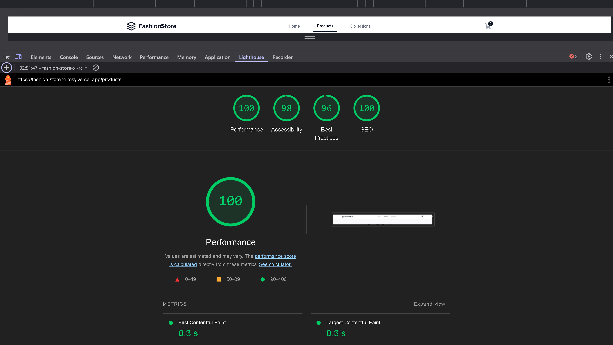
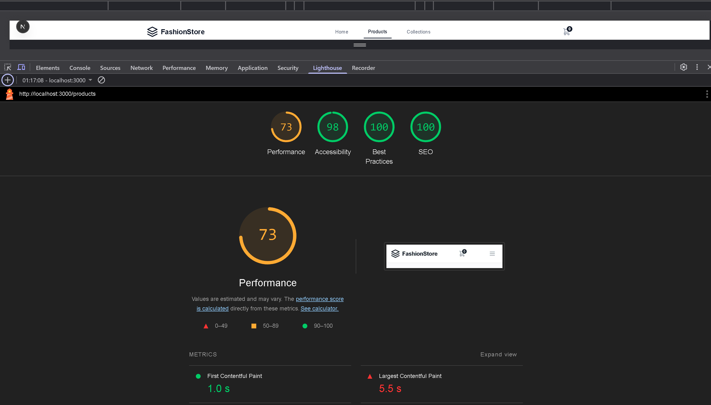

# Redis Caching with Next.js


A demonstration of Redis caching implementation in Next.js to improve application performance.

## Features

- Server-side data fetching with and without Redis caching
- Performance comparison metrics
- Basic Redis connection examples
- Simple caching demonstration

## Prerequisites

- Node.js v16+
- npm or yarn
- Redis server (optional - instructions below)

## Installation

1. Clone the repository:
```bash
git clone https://github.com/yourusername/your-repo.git
cd your-repo

2. Install dependencies :
npm install
# or
yarn install


3. Running the Application
Start the development server:

bash
npm run dev
# or
yarn dev


Live Demo :
You can view the app live at: https://fashion-store-xi-rosy.vercel.app/


### SSR with Caching:
This is the performance when using Redis caching to store fetched product data. This significantly reduces the load time as the app fetches data from Redis instead of the API on every request.



### SSR without Caching:
This shows the performance when Redis caching is disabled. Each request fetches the data from the external API, which takes longer and results in slower load times.


### CSR (Client-Side Rendering):
This screenshot shows the performance of client-side rendering, where the data is fetched on the client-side, usually resulting in a slower initial page load as it depends on JavaScript execution.



## Scaling Outline

### Handling Significant User Growth

As the user base of the app increases, several strategies can be employed to scale the application effectively and maintain performance:

1. **Horizontal Scaling of Redis:**
   - **Cluster Setup:** Upstash Redis supports clustering, which allows scaling by adding more nodes to the Redis instance. This ensures data is distributed across multiple nodes for better performance under heavy traffic.
   - **Sharding:** Implement sharding to split data across multiple Redis instances to further distribute the load.

2. **Load Balancing:**
   - **Vercel Scaling:** Since the app is hosted on Vercel, it benefits from automatic horizontal scaling. Vercel’s edge network can scale the app to multiple regions, improving performance and reliability globally.
   - **CDN Caching:** Implement a Content Delivery Network (CDN) to cache static assets like images and scripts closer to the end-user, reducing latency and improving page load times.

3. **Database and Caching:**
   - **Database Optimization:** For the database (if used), consider using read replicas or a NoSQL database like MongoDB for more efficient data retrieval as traffic increases.
   - **Cache Expiry:** Set appropriate cache expiry times in Redis to ensure that data is periodically refreshed without overloading the database with requests.

4. **Server-Side Rendering (SSR) Optimizations:**
   - **Incremental Static Regeneration (ISR):** For pages with less dynamic data, use Next.js's ISR feature to generate pages at build time and serve them from the CDN. This reduces the need to re-render pages on every request and improves performance.
   - **API Rate Limiting:** Implement rate limiting for API calls to prevent abuse and ensure fair resource usage.

5. **Monitoring and Performance Metrics:**
   - **Redis Monitoring:** Regularly monitor Redis performance and memory usage to identify and resolve bottlenecks early. Upstash provides monitoring tools that can help.
   - **Next.js Analytics:** Use tools like Lighthouse or Next.js's built-in analytics to track performance metrics and identify areas that need optimization.

By following these strategies, you can scale the app to accommodate higher traffic while maintaining excellent performance and responsiveness.

---

## Conclusion

This project demonstrates how Redis can be used to improve the performance of a Next.js application, especially in scenarios where frequent data fetching is required. By using caching strategies with Redis, we are able to reduce the load time significantly and enhance the user experience.

The application is hosted on Vercel and can be accessed live at: [Fashion Store Demo](https://fashion-store-xi-rosy.vercel.app/).

---

## Contributing

If you'd like to contribute to this project, feel free to fork the repository and submit a pull request. Please ensure that your code adheres to the existing style and passes all tests before submitting.
